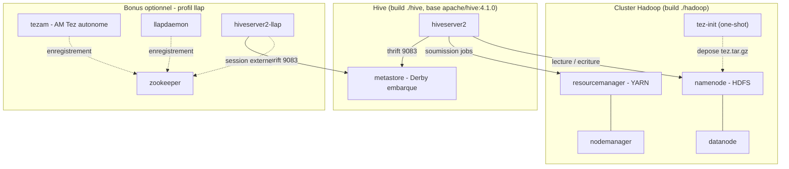

# Atelier HDFS + Hive — MapReduce / Tez / LLAP

Environnement Docker Compose prêt à l'emploi pour dérouler l'atelier
« Manipulations HDFS + Hive et benchmark moteurs Hive » : chargement HDFS,
table Hive externe, puis comparaison des moteurs d'exécution **MapReduce**,
**Tez** (par défaut) et, en bonus, **LLAP**.

Point de départ : [crystalloide/hadoop-tez-docker](https://github.com/crystalloide/hadoop-tez-docker)
(cluster Hadoop 3.4.2 + Tez 0.10.5), simplifié à 1 nœud par rôle et complété
par la couche Hive (basée sur l'image officielle `apache/hive:4.1.0`, qui
embarque Hadoop 3.4.1 et Tez 0.10.5 — versions quasi identiques à celles du
cluster, donc aucun souci de compatibilité de protocole — avec un petit
correctif local, voir [Notes techniques](#notes-techniques)).

## Architecture



Le profil bonus tourne **sans YARN** (mode Tez autonome via Zookeeper,
repris de l'environnement Docker officiel du projet Apache Hive) : c'est
volontaire, voir la section [Bonus LLAP](#bonus-llap-optionnel).

## Prérequis 1

- Docker Desktop (ou Docker Engine + Compose v2) avec **au moins 6 Go de RAM
  alloués** (8 Go si vous activez le bonus LLAP).
- Ports libres sur l'hôte : `9870`, `8088`, `9083`, `10000`, `10002`
  (`2181`, `10001`, `10012` en plus pour le bonus).
  
## Pré-requis 2 :

On récupère le projet en local : 

```bash
cd ~
sudo rm -Rf hadoop-hive-lab
git clone https://github.com/crystalloide/hadoop-hive-lab
cd hadoop-hive-lab
```   

## Démarrage rapide

```bash
docker compose up -d --build
```

Suivez l'initialisation :

```bash
docker compose logs -f tez-init
```

Vous devez voir `Tez-Init : TERMINÉ avec succès !`. Puis attendez que tout
soit "healthy" :

```bash
docker compose ps
```

`hiveserver2` peut prendre 1 à 2 minutes à démarrer (initialisation du
schéma Derby). Une fois `healthy`, l'environnement est prêt.

### Vérifier l'installation

```bash
docker exec namenode hdfs dfs -ls /apps/tez/
docker exec namenode hdfs getconf -confKey dfs.replication
docker exec resourcemanager yarn node -list
```

### Interfaces web

| Service                  | URL                          |
|---------------------------|------------------------------|
| NameNode (HDFS)            | http://localhost:9870        |
| ResourceManager (YARN)      | http://localhost:8088        |
| HiveServer2 (web UI)         | http://localhost:10002       |

## Déroulé de l'atelier

### Étape 1 — Chargement des données sur HDFS

```bash
docker exec namenode bash /opt/scripts/01_prepare_hdfs.sh
```

(`data/clients.csv` est déjà fourni — 20 clients de test — mais vous pouvez
le remplacer par le vôtre avant de lancer le script.)

### Étape 2 — Création de la table Hive externe

```bash
docker exec -it hiveserver2 beeline -u 'jdbc:hive2://localhost:10000/default' -f /opt/scripts/02_create_table.hql
```

### Étape 3 — Requête et temps de traitement

```bash
docker exec -it hiveserver2 beeline -u 'jdbc:hive2://localhost:10000/default' -f /opt/scripts/03_query_villes.hql
```

### Étape 4 — Comparaison des moteurs

Manuellement en session Beeline :

```bash
docker exec -it hiveserver2 beeline -u 'jdbc:hive2://localhost:10000/default'
```
```sql
SET hive.execution.engine=mr;
SELECT ville, COUNT(*) AS nb_clients FROM clients GROUP BY ville;

SET hive.execution.engine=tez;
SELECT ville, COUNT(*) AS nb_clients FROM clients GROUP BY ville;
```

Ou automatiquement, depuis l'hôte, avec chronométrage :

```bash
bash scripts/benchmark_engines.sh
```

Sur un jeu de données aussi petit, l'essentiel de l'écart vient du
**démarrage** du moteur (allocation de conteneurs YARN, JVM) : MapReduce
lance un ApplicationMaster puis des tâches map/reduce séquentielles,
pendant que Tez réutilise un DAG et évite les écritures disque
intermédiaires. C'est exactement l'écart que l'atelier vous fait observer
(de l'ordre de 30 à 60 s en MapReduce contre 5 à 10 s en Tez — les valeurs
réelles dépendent de la machine).

### Étape 5 — Analyse

Éléments de restitution attendus (cf. corrigé de l'atelier) : MapReduce
lent mais robuste pour du batch planifié ; Tez plus rapide grâce à son DAG
et à l'absence d'écritures intermédiaires ; LLAP quasi instantané mais plus
complexe à opérer en production.

## Bonus LLAP (optionnel)

L'énoncé indique LLAP comme optionnel (« si disponible ») — c'est aussi le
moteur le plus lourd à faire tourner correctement. Ce dépôt fournit un
profil dédié, repris de l'environnement Docker **officiel du projet Apache
Hive** (Zookeeper + AM Tez autonome + daemon LLAP), plutôt qu'une
intégration LLAP-sur-YARN maison — cette dernière demande normalement
Slider ou le service YARN natif, largement hors du cadre d'un lab. Le prix
à payer : ce mode tourne **sans YARN**, avec un HiveServer2 dédié sur un
port séparé.

```bash
docker compose --profile llap up -d
```

Puis, dans une session sur le **second** HiveServer2 (port `10001`, table
`clients` partagée via le même metastore) :

```bash
docker exec -it hiveserver2-llap beeline -u 'jdbc:hive2://localhost:10000/default'
```
```sql
SET hive.execution.engine=tez;
SET hive.llap.execution.mode=all;
SELECT ville, COUNT(*) AS nb_clients FROM clients GROUP BY ville;
```

`scripts/benchmark_engines.sh` détecte automatiquement `hiveserver2-llap`
s'il tourne et ajoute la mesure LLAP à la comparaison.

**Honnêtement :** ce bonus n'a pas pu être testé de bout en bout dans les
mêmes conditions que le socle HDFS/YARN/Hive/Tez (build/exécution Docker
réels indisponibles depuis l'environnement où j'ai préparé ce dossier). Il
reprend fidèlement le câblage officiel Apache Hive, mais s'il coince,
retirez simplement `--profile llap` : l'atelier reste complet avec
MapReduce et Tez, qui sont le cœur du sujet.

## Dépannage

- **Le build échoue sur `yum install ... java-11-openjdk` avec des
  `Could not retrieve mirrorlist` / `HTTP Error 404` en boucle** : c'était
  une première tentative de correctif de ce dossier, qui reposait sur
  `yum` — or CentOS 7 (base de l'image `apache/hadoop:3.4.2`) est en fin
  de vie depuis juin 2024 et ses dépôts pour ce point de version précis ne
  sont quasiment plus servis par les miroirs publics. Corrigé dans cette
  version : le JDK est maintenant téléchargé directement (archive Eclipse
  Temurin), sans passer par `yum`. Si vous êtes sur une version antérieure
  du dossier, `docker compose down -v` puis `docker compose up -d --build`
  avec le nouveau `hadoop/Dockerfile` suffit.
- **`Unrecognized option: --add-opens=...` / `TezSession has already
  shutdown`** au lancement de l'AM Tez : bug connu côté Apache Hive/Tez
  ([HIVE-29015](https://issues.apache.org/jira/browse/HIVE-29015)) quand
  Hive (JDK17+) soumet un job à un cluster Hadoop resté en JDK 8. Corrigé
  dans cette version en passant les conteneurs Hadoop en JDK 17 (voir
  [Notes techniques](#notes-techniques)). Sur un cluster déjà démarré avec
  une version antérieure, il faut reconstruire les images Hadoop — un
  simple restart ne suffit pas ici (le JDK est dans l'image) :
  `docker compose down -v` puis `docker compose up -d --build`. Comme HDFS
  n'est pas persisté entre deux `down -v`, il faudra recharger
  `clients.csv` (étape 1) et recréer la table (étape 2) après coup.
- **`UnsupportedClassVersionError` (`... class file version 61.0 ...
  only recognizes ... up to 55.0`) juste après que l'erreur ci-dessus a
  disparu** : un premier correctif de ce dossier avait basculé Hadoop sur
  JDK 11 (suffisant pour la syntaxe `--add-opens`, cf. ci-dessus), mais
  `hive-exec-4.1.0.jar` est en réalité compilé pour cibler le bytecode
  Java 17 (class file 61) — JDK 11 ne reconnaît que jusqu'à la version 55.
  Corrigé dans cette version : JDK 17, pas 11. Même procédure de
  reconstruction que ci-dessus.
- **`Permission denied: user=hive, access=WRITE, inode="/tmp"`** en
  basculant sur `SET hive.execution.engine=mr;` : corrigé dans cette
  version (voir [Notes techniques](#notes-techniques)). Sur un cluster
  déjà démarré, pas besoin de reconstruire ni de recharger les données —
  un simple `docker exec namenode hdfs dfs -chmod 1777 /tmp` débloque
  immédiatement la session en cours.
- **`NoClassDefFoundError: org/apache/commons/collections/CollectionUtils`
  pendant l'exécution d'une tâche Tez** (le DAG se soumet et démarre, mais
  chaque tentative de tâche `Map`/`Reducer` échoue) : corrigé dans cette
  version en ajoutant le jar `commons-collections` (l'ancien, pas
  `commons-collections4`) à `/opt/tez/lib/` — voir
  [Notes techniques](#notes-techniques). Même procédure de reconstruction
  que ci-dessus (`down -v` puis `up -d --build`).
- **`File file:/opt/hive/install_dir/... does not exist` / `TezSession has
  already shutdown`** : provoqué par un correctif intermédiaire de ce
  dossier (`hive.user.install.directory` pointé en local) qui s'est avéré
  incompatible avec le vrai cluster YARN multi-conteneurs de ce lab — voir
  [Notes techniques](#notes-techniques). Corrigé (propriété retirée) dans
  cette version. Sur un cluster déjà démarré avec la version fautive,
  pas besoin de tout reconstruire : remplacez votre
  `hive-conf/hive-site.xml` par celui de ce dossier, puis
  `docker compose restart hiveserver2` (la config est montée en
  bind-mount, `restart` suffit à la faire relire).
- **`Permission denied: user=hive, access=WRITE, inode="/user/hive"`** au
  lancement d'une requête Tez : corrigé dans cette version (voir
  [Notes techniques](#notes-techniques)). Si un cluster est déjà démarré
  avec une version antérieure du dossier, pas besoin de tout redémarrer —
  un simple `docker exec namenode hdfs dfs -chmod -R 1777 /user/hive`
  débloque immédiatement la session en cours.
- **`metastore` quitte avec `find: command not found` puis
  `Failed to create database 'metastore_db'`** : corrigé dans cette
  version (voir [Notes techniques](#notes-techniques)). Si vous repartez
  d'une version antérieure du dossier, relancez avec
  `docker compose up -d --build` pour reconstruire l'image `hive/` corrigée,
  et faites `docker compose down -v` avant si un volume `metastore-db`
  traînait encore d'un essai précédent.
- **`tez-init` échoue en timeout** : le NameNode n'est pas sorti du safe
  mode à temps. Relancez `docker compose up -d tez-init`.
- **Table introuvable / warehouse vide** : vérifiez que
  `01_prepare_hdfs.sh` a bien été exécuté avant la création de la table.
- **Redémarrage à froid propre** : `docker compose down -v` puis
  `docker compose up -d --build` repart d'un état neuf (HDFS, métastore et
  volumes réinitialisés).
- **`hiveserver2` reste `unhealthy` longtemps** : normal la toute première
  fois (initialisation du schéma Derby + attente de YARN) ; regardez
  `docker compose logs hiveserver2`.
- **Erreur mémoire / conteneurs tués (OOM)** : augmentez la RAM allouée à
  Docker Desktop (Settings → Resources).

## Nettoyage

```bash
docker compose --profile llap down -v
```

## Notes techniques

- **`/tmp` lui-même doit être ouvert en écriture (`1777`), pas seulement
  ses sous-dossiers.** Le moteur MapReduce classique
  (`hive.execution.engine=mr`) crée son répertoire de staging directement
  sous `/tmp` (`/tmp/hadoop-yarn/staging/hive/.staging`) au premier job
  soumis ; `/tmp` était resté à sa permission HDFS par défaut (`755`,
  propriétaire `hadoop`), ce qui bloquait l'utilisateur `hive`
  (`Permission denied: user=hive, access=WRITE, inode="/tmp"`). Corrigé en
  ouvrant `/tmp` lui-même dans `init-tez.sh` — même famille de bug que
  `/user/hive` plus haut : chmoder les sous-dossiers qu'on crée ne suffit
  pas si le dossier parent, lui, reste fermé.
- **`/opt/tez/lib/` embarque aussi `commons-collections-3.2.2.jar`.** Du
  code interne à `hive-exec-4.1.0.jar` (`Operator.initializeChildren`)
  utilise encore l'ancienne bibliothèque `commons-collections`
  (`org.apache.commons.collections.CollectionUtils`, pas
  `commons-collections4`), que Hadoop 3.4.x n'embarque plus par défaut —
  chaque tâche Tez qui initialise un opérateur plantait avec
  `NoClassDefFoundError` sans ce jar. Il est placé dans `/opt/tez/lib/`
  car ce chemin fait déjà partie de `yarn.application.classpath`
  (`hadoop/config`, dupliqué dans `hive-conf/yarn-site.xml`), donc
  disponible pour l'AM et toutes les tâches sans configuration par job. Si
  une erreur `NoClassDefFoundError` similaire réapparaît pour une autre
  classe, la même recette s'applique : trouver le jar Maven correspondant
  et le déposer au même endroit.
- **Les conteneurs Hadoop tournent en JDK 17, pas en JDK 8 (par défaut de
  l'image `apache/hadoop:3.4.2`).** Deux problèmes distincts avec l'image
  officielle `apache/hive` (4.1.0) : (1) elle ajoute automatiquement des
  options JVM `--add-opens=...` en soumettant un job Tez, qu'un JDK 8 ne
  reconnaît pas ("Unrecognized option") ; (2) `hive-exec-4.1.0.jar` est
  compilé pour cibler le bytecode Java 17 (class file version 61) — un
  JDK 11, qui accepte pourtant la syntaxe `--add-opens` (JDK9+), ne peut
  toujours pas charger ces classes (`UnsupportedClassVersionError`). Les
  deux se règlent en passant Hadoop sur JDK 17. Bug connu et non réglable
  côté configuration Hive/Tez, voir
  [HIVE-29015](https://issues.apache.org/jira/browse/HIVE-29015), où le
  rapporteur confirme avoir testé exactement cette combinaison (Hadoop
  3.4.1 sous JDK 17) avec succès.
  **Installé par téléchargement direct d'une archive Eclipse Temurin
  (Adoptium), pas via `yum`** : cette image est basée sur CentOS 7, dont
  les dépôts `os`/`updates` pour ce point de version précis (7.6.1810) ont
  disparu des miroirs publics depuis la fin de vie de CentOS 7 (juin
  2024) — `yum install` y échoue désormais quasiment à chaque fois. Voir
  `hadoop/Dockerfile`.
- **`/user/hive` doit être accessible en écriture à l'utilisateur `hive`.**
  Au premier lancement d'une session Tez, Hive met en cache un jar de
  session sous `/user/<utilisateur>` sur HDFS — ici `/user/hive`, qui
  n'appartenait qu'à `hadoop` (celui qui exécute `init-tez.sh`), pas à
  `hive` (celui qui fait tourner HiveServer2) :
  `Permission denied: user=hive, access=WRITE`. Corrigé dans
  `hadoop/init-tez.sh`, qui ouvre `/user/hive` en écriture pour tout le
  monde (`chmod -R 1777`).
  Ce répertoire est **volontairement laissé sur HDFS**, pas redirigé vers
  un chemin local (`hive.user.install.directory`) comme le fait le
  quickstart officiel Apache Hive — une piste explorée puis abandonnée ici,
  documentée directement dans `hive-conf/hive-site.xml` : ce raccourci ne
  fonctionne que pour un Hive en mode local/mono-processus (leur
  quickstart par défaut), pas pour un vrai cluster YARN multi-conteneurs
  comme celui-ci, où le NodeManager qui "localise" ce jar pour lancer l'AM
  Tez est un conteneur différent de `hiveserver2` et ne voit donc aucun
  chemin local à ce dernier.
- **`hive/Dockerfile` ajoute `findutils` par-dessus `apache/hive:4.1.0`.**
  Cette image officielle (base `eclipse-temurin ubi9-minimal`) n'installe
  pas `find`, alors que son propre `entrypoint.sh` s'en sert pour appliquer
  `HIVE_CUSTOM_CONF_DIR` — le mécanisme qui pointe Hive vers notre cluster
  HDFS/YARN/Tez. Sans ce correctif, `find` échoue silencieusement (le
  script continue sans erreur bloquante) et **toute** la configuration de
  `hive-conf/` est ignorée : Hive tombe alors sur ses réglages par défaut,
  déconnectés du cluster. `metastore`, `hiveserver2`, `tezam`, `llapdaemon`
  et `hiveserver2-llap` utilisent tous cette image corrigée.
- **Pas de volume nommé pour le Derby du metastore.** Un volume Docker
  nommé fraîchement créé appartient à `root` par défaut, alors que le
  processus Hive tourne avec un utilisateur non-root (`hive`, uid 1000) :
  Derby ne peut alors plus créer sa base au premier démarrage
  (`Failed to create database`). Comme la persistance entre sessions
  n'est de toute façon pas nécessaire pour cet atelier (on repart d'un état
  propre à chaque fois avec `docker compose down -v`), le plus sûr est de
  ne pas monter de volume ici : la base Derby vit dans la couche writable
  du conteneur `metastore`, avec les bonnes permissions héritées de l'image.
- **Hive 4.1.0** a été choisi (plutôt que 4.0.x ou 4.2.x) car c'est la
  version dont le couple Hadoop/Tez annoncé par le projet Apache Hive
  (Hadoop 3.4.1 / Tez 0.10.5) colle le mieux à la version du cluster
  (Hadoop 3.4.2 / Tez 0.10.5) — Tez identique, Hadoop quasi identique.
- **`hive-conf/mapred-site.xml` met `mapreduce.framework.name=yarn`**
  (classique), volontairement différent du `yarn-tez` utilisé sur les
  conteneurs Hadoop bruts (`hadoop/config`, hérité du dépôt de référence
  pour lancer un `hadoop jar ... wordcount` directement accéléré par Tez).
  Si Hive héritait de `yarn-tez`, `SET hive.execution.engine=mr;` serait
  silencieusement réexécuté par Tez, et l'atelier ne pourrait plus montrer
  d'écart entre les deux moteurs.
- Le métastore utilise Derby **embarqué**, mais dans son propre conteneur
  dédié : `hiveserver2` (et `hiveserver2-llap`) s'y connectent uniquement
  en Thrift, jamais en direct — ce qui évite la limitation Derby
  « un seul processus à la fois » tout en gardant l'environnement simple
  (pas de Postgres à faire tourner ni de driver JDBC à télécharger).
